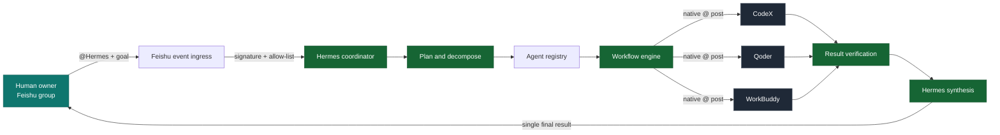
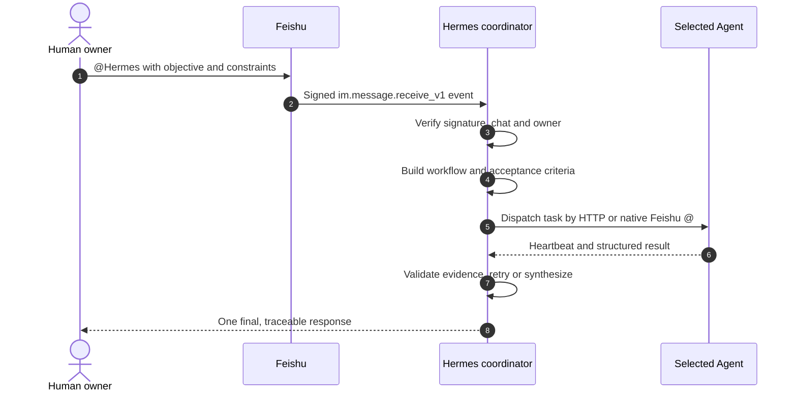
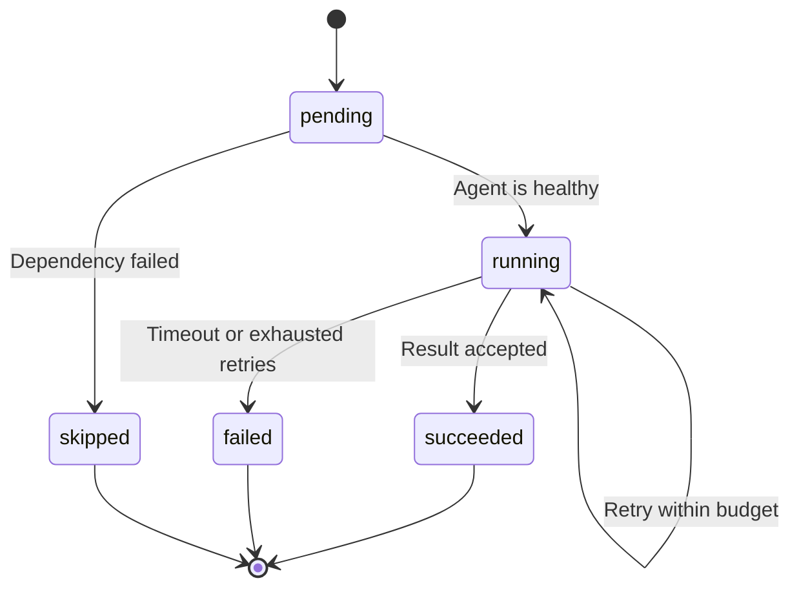
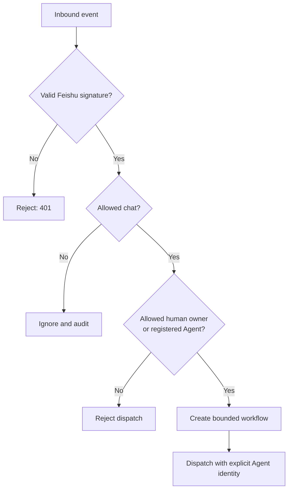

<div align="center">

# Hermes Feishu A2A


**A self-hosted control plane for running a secure, observable AI-agent team inside Feishu/Lark.**

[](https://github.com/ChrysFu-FndVent/hermes-feishu-a2a/actions/workflows/ci.yml)
[](https://github.com/ChrysFu-FndVent/hermes-feishu-a2a/actions/workflows/release.yml)
[](https://github.com/ChrysFu-FndVent/hermes-feishu-a2a/actions/workflows/publish-container.yml)
[](https://www.python.org/)
[](https://fastapi.tiangolo.com/)
[](Dockerfile)
[](LICENSE)


[Quick start](#quick-start) · [How it works](#how-it-works) · [Agent contract](#agent-contract) · [Feishu setup](#feishu-setup) · [Examples](#example-workflows) · [Operations](docs/deployment.md)

</div>

---

Hermes is the group brain and lead. It turns a human request into bounded tasks,
selects registered Agents, tracks heartbeats, executes serial or dependency-aware
parallel workflows, retries transient failures, and owns the single final-delivery
path. CodeX, Qoder, WorkBuddy, and future Agents keep their own runtimes and tools;
this service owns coordination, identity, and workflow state.

## Project at a glance

| Capability | What the project does | Operational guarantee |
| --- | --- | --- |
| Agent registry | Stores identity, role, capabilities, transport and permissions | One record per real Agent identity |
| Workflow engine | Runs serial pipelines and dependency-aware parallel DAGs | Dependency barriers and bounded concurrency |
| Health monitoring | Consumes heartbeats and marks stale Agents offline | No silent disappearance from the team |
| Failure recovery | Applies task timeouts, exponential backoff and retry budgets | Failed dispatches become visible and auditable |
| Feishu transport | Sends structured native `at` posts to registered `open_id` values | No display-name identity guessing |
| Result synthesis | Collects task results into one run-level output | One coordinator-owned delivery path |
| Security boundary | Verifies webhook bytes, chat allow-lists and internal API tokens | No credentials in prompts or repository data |

> [!IMPORTANT]
> This project coordinates Agents; it does not impersonate or remotely control
> vendor desktop applications. Every Agent needs an explicit HTTP or Feishu
> adapter that can receive a task and return a result.

## How it works



<details>
<summary><strong>Open the end-to-end message sequence</strong></summary>



</details>

### Role model

| Agent | Team role | Typical capabilities | Delivery rule |
| --- | --- | --- | --- |
| **Hermes** | Brain and lead | Planning, delegation, synthesis, conflict resolution | Owns intake and acceptance |
| **CodeX** | Engineering deputy | Coding, debugging, review, build | Delivers only after coordinator approval |
| **Qoder** | Technical executor | Shell, files, diagnostics, test execution | Reports evidence to Hermes |
| **WorkBuddy** | Collaboration support | Research, writing, analysis, cross-checking | Reports findings and gaps to Hermes |

## Quick start

### 1. Install

```bash
git clone https://github.com/ChrysFu-FndVent/hermes-feishu-a2a.git
cd hermes-feishu-a2a
python3.11 -m venv .venv
source .venv/bin/activate          # Windows: .venv\Scripts\activate
pip install -e '.[dev]'
```

### 2. Configure

```bash
cp .env.example .env
cp config/agents.example.yaml config/agents.yaml
```

Replace every placeholder in `.env` and `config/agents.yaml`. Generate independent,
random values for `HERMES_SECRET_KEY` and `HERMES_INTERNAL_API_TOKEN`; never reuse a
Feishu App Secret as an internal API token.

```bash
hermes-a2a validate-config --path config/agents.yaml
```

### 3. Run

```bash
hermes-a2a serve
```

The API starts at `http://localhost:8080`. Interactive OpenAPI documentation is
available at [`http://localhost:8080/docs`](http://localhost:8080/docs).

```bash
curl http://localhost:8080/healthz
curl -H 'X-Hermes-Token: replace-with-a-long-random-token' \
  http://localhost:8080/agents
```

<details>
<summary><strong>Run with Docker instead</strong></summary>

```bash
docker compose up --build -d
docker compose logs -f hermes
curl http://localhost:8080/readyz
```

The compose stack persists SQLite data under `./data`. Production deployments
should terminate TLS at a reverse proxy and inject `.env` values through a managed
secret store.

</details>

## Agent contract

An Agent registers through `POST /agents`, then sends a heartbeat at least every
two minutes. Two missed heartbeat intervals mark it `offline`; repeated dispatch
failures mark it `degraded`.

```json
{
  "id": "codex",
  "display_name": "CodeX",
  "role": "code implementation and delivery",
  "capabilities": ["coding", "review", "build"],
  "transport": "http",
  "endpoint": "https://codex.internal/agent",
  "permissions": ["task:execute", "result:write"]
}
```

| Endpoint | Authentication | Purpose |
| --- | --- | --- |
| `GET /healthz` | Public, network-restricted | Liveness probe |
| `GET /readyz` | Public, network-restricted | Production configuration readiness |
| `GET /metrics` | Public, network-restricted | Agent and workflow counters |
| `GET/POST /agents` | `X-Hermes-Token` | List or register Agents |
| `POST /agents/{id}/heartbeat` | `X-Hermes-Token` | Update health and capabilities |
| `POST /workflows` | `X-Hermes-Token` | Store a workflow definition |
| `POST /workflows/{id}/run` | `X-Hermes-Token` | Start execution |
| `GET /runs/{run_id}` | `X-Hermes-Token` | Inspect state and results |
| `POST /events/agent-result` | `X-Hermes-Token` | Accept asynchronous Agent output |
| `POST /webhooks/feishu` | Feishu signature | Receive Feishu events |

### Task lifecycle



## Feishu setup

Each team member needs its own Feishu custom app and bot identity. Add every bot
to the collaboration group before testing.

1. Enable message read/send and chat read scopes for Hermes.
2. Enable `im:message.group_at_msg.include_bot:readonly` for native bot-to-bot
   mention delivery.
3. Enable `im:chat.announcement:read` when an Agent must read the pinned group
   announcement.
4. Subscribe to `im.message.receive_v1` and point HTTPS callbacks to
   `/webhooks/feishu`, or use a compatible long-connection adapter.
5. Publish a new application version and obtain tenant administrator approval.
6. Configure explicit `oc_...` chat and `ou_...` owner allow-lists. The numeric ID
   shown in a client URL is not an Open API chat ID.

See the complete [scope matrix and webhook checklist](docs/feishu-permissions.md),
then pin the provided [group announcement](config/group-announcement.md).

<details>
<summary><strong>Configuration reference</strong></summary>

| Variable | Purpose |
| --- | --- |
| `HERMES_FEISHU_APP_ID` | Hermes coordinator app ID (`cli_...`) |
| `HERMES_FEISHU_APP_SECRET` | Coordinator App Secret; secret manager only |
| `HERMES_FEISHU_ENCRYPT_KEY` | Encrypted event payload key |
| `HERMES_FEISHU_VERIFICATION_TOKEN` | Webhook verification token |
| `HERMES_FEISHU_ALLOWED_CHAT_IDS` | Comma-separated `oc_...` allow-list |
| `HERMES_FEISHU_OWNER_OPEN_IDS` | Human owners allowed to initiate workflows |
| `HERMES_INTERNAL_API_TOKEN` | Protects registration and workflow APIs |
| `HERMES_SECRET_ENCRYPTION_KEY` | Optional Fernet key for persisted secrets |
| `HERMES_DATABASE_URL` | SQLite URL by default; replace the Store boundary for PostgreSQL |

All settings use the `HERMES_` prefix. See [`.env.example`](.env.example) and
[`config/agents.example.yaml`](config/agents.example.yaml).

</details>

## Example workflows

| Scenario | Execution shape | Team contribution | Definition |
| --- | --- | --- | --- |
| Content review | Parallel fan-out | Policy, language and technical checks | [`content-review.yaml`](examples/content-review.yaml) |
| Data analysis | Serial pipeline | Gather, model, then independently review | [`data-analysis.yaml`](examples/data-analysis.yaml) |
| Multi-agent Q&A | Evidence chain | Plan, research, implement and execute checks | [`multi-agent-qa.yaml`](examples/multi-agent-qa.yaml) |

```yaml
name: content-review
mode: parallel
tasks:
  - id: policy
    agent_id: hermes
    prompt: Classify content against the published policy.
  - id: language
    agent_id: workbuddy
    prompt: Check clarity, tone and harmful ambiguity.
  - id: technical
    agent_id: codex
    prompt: Verify links, code and technical claims.
```

The engine honors `depends_on`, `timeout_seconds`, and `retries`. Parallel mode
runs every ready task concurrently while preserving dependency barriers.

## Security model



- Raw webhook bytes are authenticated before JSON parsing.
- Internal APIs require a separate token and should also be network-restricted.
- Secrets use `SecretStr`, are redacted from logs, and may be encrypted with Fernet.
- Display names never establish identity; routing uses registered IDs and allow-lists.
- Direct Agent message sending is disabled by policy to prevent cross-bot identity leaks.
- Example files contain placeholders only. Run `python scripts/check_secrets.py` in CI.

Read the [identity-boundary postmortem](docs/identity-boundary-postmortem.md) for
the operational rule behind connector-only delivery.

## Deployment and compatibility

| Target | Supported path |
| --- | --- |
| Linux | Python 3.11+, systemd or Docker, TLS reverse proxy |
| macOS | Python 3.11+, launchd or Docker Desktop |
| Windows | Python 3.11+, Windows Service or Docker Desktop |
| Container platforms | Multi-platform image for `linux/amd64` and `linux/arm64` |

Tags such as `v0.1.0` create a GitHub Release with wheel, source distribution and
SHA-256 checksums, plus a container image:

```bash
docker pull ghcr.io/chrysfu-fndvent/hermes-feishu-a2a:latest
```

See [deployment](docs/deployment.md), [best practices](docs/best-practices.md), and
[troubleshooting](docs/troubleshooting.md) for production guidance and upgrade notes.

## Development

```bash
pip install -e '.[dev]'
ruff check .
mypy src
pytest -q
python scripts/check_secrets.py
python -m build
```

Contributions are welcome. Read [`CONTRIBUTING.md`](CONTRIBUTING.md), keep real
credentials out of commits, and include tests for every workflow or security
change. This project is released under the [`MIT License`](LICENSE).

---

<div align="center">

**Hermes coordinates. Agents execute. Evidence decides.**

</div>
