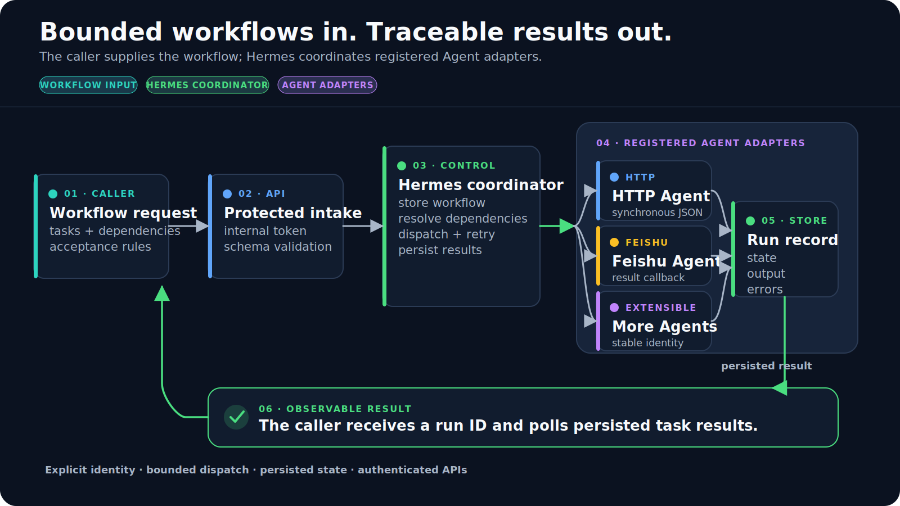
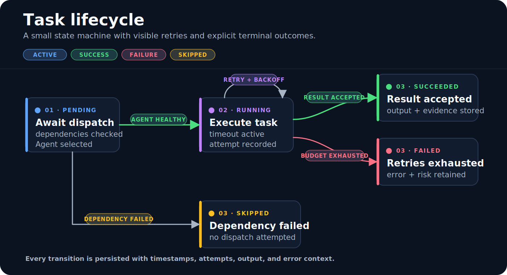
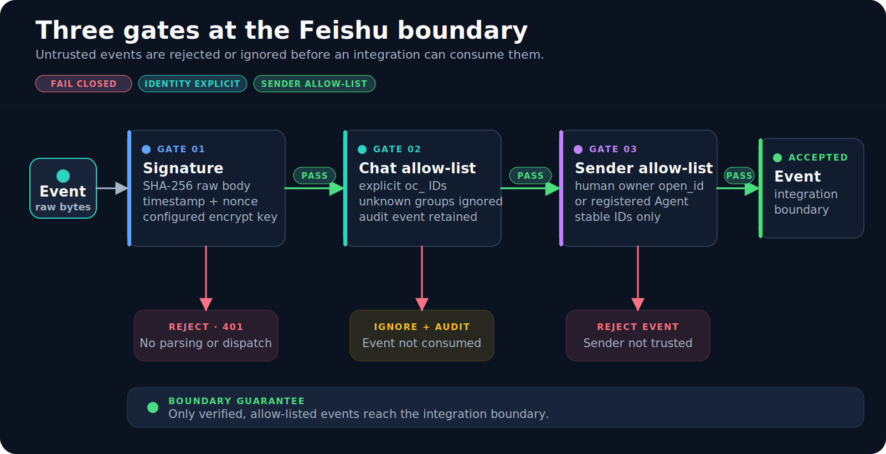

# Hermes Feishu A2A

<p align="center">
  
</p>

A self-hosted workflow coordinator for dispatching bounded tasks to registered
Agents through HTTP or Feishu/Lark.

[](https://github.com/ChrysFu-FndVent/hermes-feishu-a2a/actions/workflows/ci.yml)
[](https://www.python.org/)
[](Dockerfile)
[](LICENSE)

Hermes stores Agent identities and workflow state, enforces dependency barriers,
dispatches ready tasks, applies timeouts and retries, and exposes run results through
an authenticated API. Feishu webhook events are verified against the configured
signature, chat and sender allow-lists.

Hermes does not include an LLM planner or an Agent runtime. A caller must submit a
workflow definition, and every Agent must expose either an HTTP adapter or a Feishu
adapter that returns results to Hermes. Feishu file intake is a deterministic exception:
when configured, authorized file messages are routed to one registered intake Agent.

## Supported platforms

| Platform | Native installation | Container installation | Continuous validation |
| --- | --- | --- | --- |
| macOS | Python 3.11 or newer | Docker Desktop | `macos-latest` |
| Windows | Python 3.11 or newer | Docker Desktop with Linux containers | `windows-latest` |
| Linux | Python 3.11 or newer | Docker Engine and Compose v2 | `ubuntu-latest` |

The Python wheel is platform-independent. The published container supports
`linux/amd64` and `linux/arm64`.

## Architecture



## Quick start

### 1. Install

Prerequisites: Git and Python 3.11 or newer.

macOS or Linux:

```bash
git clone https://github.com/ChrysFu-FndVent/hermes-feishu-a2a.git
cd hermes-feishu-a2a
python3 -m venv .venv
.venv/bin/python -m pip install --upgrade pip
.venv/bin/python -m pip install .
```

Windows PowerShell:

```powershell
git clone https://github.com/ChrysFu-FndVent/hermes-feishu-a2a.git
Set-Location hermes-feishu-a2a
py -3.11 -m venv .venv
.venv\Scripts\python.exe -m pip install --upgrade pip
.venv\Scripts\python.exe -m pip install .
```

These commands do not require shell activation, so they also work when PowerShell
script execution is restricted.

### 2. Configure

macOS or Linux:

```bash
cp .env.example .env
cp config/agents.example.yaml config/agents.yaml
```

Windows PowerShell:

```powershell
Copy-Item .env.example .env
Copy-Item config\agents.example.yaml config\agents.yaml
```

Edit both files and replace every placeholder. The required production settings are:

| Variable | Purpose |
| --- | --- |
| `HERMES_INTERNAL_API_TOKEN` | Random value of at least 32 characters for protected APIs |
| `HERMES_FEISHU_APP_ID` | Feishu/Lark custom app ID |
| `HERMES_FEISHU_APP_SECRET` | Custom app secret |
| `HERMES_FEISHU_ENCRYPT_KEY` | Event subscription encrypt key used for signatures |
| `HERMES_FEISHU_VERIFICATION_TOKEN` | Event subscription verification token |
| `HERMES_FEISHU_ALLOWED_CHAT_IDS` | Comma-separated `oc_...` chat IDs |
| `HERMES_FEISHU_OWNER_OPEN_IDS` | Comma-separated `ou_...` human owner IDs |
| `HERMES_FEISHU_FILE_INTAKE_AGENT_ID` | Registered Agent that processes authorized Feishu file messages |
| `HERMES_AGENTS_CONFIG_PATH` | Agent registry file, normally `config/agents.yaml` |

`HERMES_PORT` controls native Python startup. `HERMES_PUBLISHED_PORT` controls the
host port used by Docker Compose; the container always listens on port 8080.

Generate the internal API token locally:

```bash
python3 -c "import secrets; print(secrets.token_urlsafe(48))"
```

On Windows, use `py -3.11` instead of `python3`.

Each HTTP Agent needs an `endpoint`. Each Feishu Agent needs an `open_id` and
`metadata.chat_id`. Invalid Agent records stop validation and startup instead of
failing during the first dispatch.

Validate the complete configuration:

macOS or Linux:

```bash
.venv/bin/hermes-a2a validate-config --path config/agents.yaml
```

Windows PowerShell:

```powershell
.venv\Scripts\hermes-a2a.exe validate-config --path config\agents.yaml
```

### 3. Run

macOS or Linux:

```bash
.venv/bin/hermes-a2a serve
```

Windows PowerShell:

```powershell
.venv\Scripts\hermes-a2a.exe serve
```

Open these URLs after startup:

- `http://127.0.0.1:8080/healthz` for process health.
- `http://127.0.0.1:8080/readyz` for production configuration readiness.
- `http://127.0.0.1:8080/docs` for the interactive API.

`/readyz` returns HTTP 503 in production until all required Feishu values and
allow-lists are real, non-placeholder values.

## Docker

Docker uses the same `.env` and `config/agents.yaml` files created above.

```bash
docker compose up --build -d
docker compose ps
docker compose logs -f hermes
```

The Compose file uses a named volume for SQLite data. This avoids host directory
ownership problems on Linux and works with Docker Desktop on macOS and Windows.

Stop the service without deleting data:

```bash
docker compose down
```

Delete the named data volume only when you intentionally want to erase all Agent,
workflow and run records:

```bash
docker compose down --volumes
```

## Agent contract

Agents are preloaded from `config/agents.yaml` with `offline` status. An adapter must
send a heartbeat before Hermes dispatches work to it.

```json
{
  "status": "online",
  "capabilities": ["review", "testing"]
}
```

Send this payload to `POST /agents/{agent_id}/heartbeat` with the
`X-Hermes-Token` header.

### HTTP Agents

Hermes sends an HTTP `POST` request to the configured endpoint:

```json
{
  "run_id": "run-123",
  "task": {
    "id": "review",
    "title": "Review",
    "prompt": "Check the result",
    "agent_id": "reviewer"
  },
  "attachments": []
}
```

When a task contains Feishu attachment references, Hermes downloads and parses them
at dispatch time. The top-level `attachments` array then contains `name`, `media_type`,
`text`, and the original safe reference. File bytes and Feishu credentials are never
sent to the Agent.

The endpoint must return JSON containing `output` or `message`.

```json
{"output": "Review completed"}
```

### Feishu Agents

Hermes sends a native `at` post to the configured `open_id` and waits for the Agent
to reply in that task message thread or call `POST /events/agent-result`. Thread replies
are matched to the task message and registered Agent `open_id`. API callbacks must
include the same `run_id`, `task_id` and assigned `agent_id`.

For tasks with attachments, the native post includes the bounded extracted text after
the task prompt. Large content is truncated at `HERMES_FEISHU_FILE_MAX_AGENT_CHARS`.

```json
{
  "run_id": "run-123",
  "task_id": "review",
  "agent_id": "reviewer",
  "success": true,
  "output": "Review completed"
}
```

If neither a matching thread reply nor callback arrives before the task timeout, Hermes
applies the configured retry budget and eventually marks the task failed.

## Run a workflow

1. Confirm the target Agents are `online` with `GET /agents`.
2. Submit a JSON workflow definition to `POST /workflows`.
3. Start it with `POST /workflows/{workflow_id}/run`.
4. Poll `GET /runs/{run_id}` until the run is `succeeded` or `failed`.

All four endpoints require `X-Hermes-Token`. The interactive API at `/docs` is the
most portable way to perform the first run on macOS, Windows and Linux. Example
workflow definitions are available in [`examples/`](examples/).



## Feishu setup

1. Create a Feishu/Lark custom app and enable bot functionality.
2. Grant message receive/send and chat read permissions required by your tenant.
3. Grant `im:resource` for files attached directly to messages.
4. Grant the application-identity scope `drive:file:download` for shared
   `/file/...` cloud-space links. The broader `drive:drive:readonly` scope also
   works, but is not required.
5. Subscribe to `im.message.receive_v1`.
6. Set the HTTPS callback to `https://your-host.example/webhooks/feishu`.
7. Copy the app ID, app secret, encrypt key and verification token into `.env`.
8. Add explicit chat and owner open IDs to the allow-lists.
9. Publish the app version, obtain tenant approval, and add the bot to the target chat.

The webhook authenticates the raw request body before JSON parsing, then checks the
verification token, chat ID and sender identity. An accepted message is an integration
event; this service does not automatically translate natural language into a workflow.
Use an external planner or adapter to call the workflow API when that behavior is needed.

### File intake

Set `HERMES_FEISHU_FILE_INTAKE_AGENT_ID` to an HTTP or Feishu Agent from
`config/agents.yaml`, grant that Agent `attachment:read`, then make sure it sends an
`online` heartbeat. When an allow-listed human posts a supported attachment or a
`/file/...` link, Hermes:

1. extracts the message resource key or Drive file token;
2. downloads the file with the app's tenant token;
3. enforces the configured file-count, compressed/uncompressed byte, type and text limits;
4. extracts text from PDF, DOCX, TXT, Markdown, CSV or JSON;
5. starts one workflow on the intake Agent; and
6. replies to the original Feishu message with the Agent result.

Events are claimed by event/message ID so Feishu retries do not create duplicate runs.
Messages sent by registered Agents or other apps never trigger file intake, preventing
bot reply loops. Image-only or scanned PDFs require an external OCR adapter; Hermes
rejects PDFs that contain no extractable text.

See [Feishu permissions and event setup](docs/feishu-permissions.md) for the detailed
scope and callback checklist.



## API reference

| Endpoint | Authentication | Purpose |
| --- | --- | --- |
| `GET /healthz` | Network restriction | Process health |
| `GET /readyz` | Network restriction | Production configuration readiness |
| `GET /metrics` | Network restriction | Agent and workflow counters |
| `GET/POST /agents` | `X-Hermes-Token` | List or register Agents |
| `POST /agents/{id}/heartbeat` | `X-Hermes-Token` | Update Agent health |
| `POST /workflows` | `X-Hermes-Token` | Store a workflow definition |
| `POST /workflows/{id}/run` | `X-Hermes-Token` | Start execution |
| `GET /runs/{run_id}` | `X-Hermes-Token` | Inspect task states and results |
| `POST /events/agent-result` | `X-Hermes-Token` | Complete an asynchronous Agent task |
| `POST /webhooks/feishu` | Feishu signature and token | Receive Feishu events |

## Production deployment

- Terminate TLS at a reverse proxy or managed load balancer.
- Expose only `/webhooks/feishu` publicly.
- Keep internal APIs on a private network in addition to using the internal token.
- Pin a release tag or container digest instead of deploying `main` directly.
- Back up the SQLite volume before upgrades.

Published release assets include a platform-independent wheel and source archive.
Published container tags support `linux/amd64` and `linux/arm64`:

```bash
docker pull ghcr.io/chrysfu-fndvent/hermes-feishu-a2a:latest
```

See [deployment](docs/deployment.md), [best practices](docs/best-practices.md), and
[troubleshooting](docs/troubleshooting.md) for operational details.

## Development

```bash
python -m pip install -e '.[dev]'
ruff check .
mypy src
pytest -q
python scripts/check_secrets.py
python -m build
```

See [CONTRIBUTING.md](CONTRIBUTING.md). This project is released under the
[MIT License](LICENSE).
