<!-- README-ARCHITECT: visual-shell -->
<p align="center">
  
</p>
<p align="center">
  <a href="https://github.com/ChrysFu/hermes-feishu-a2a/stargazers"></a>
  <a href="https://github.com/ChrysFu/hermes-feishu-a2a/releases"></a>
  <a href="https://github.com/ChrysFu/hermes-feishu-a2a/commits/main"></a>
  <a href="https://github.com/ChrysFu/hermes-feishu-a2a/search?l=Python"></a>
  <a href="https://github.com/ChrysFu/hermes-feishu-a2a/blob/main/LICENSE"></a>
</p>
<!-- README-ARCHITECT: visual-shell end -->

<div align="right"><a href="#english">English</a> | <a href="#简体中文">简体中文</a></div>

<a id="english"></a>

# Hermes Feishu A2A

<p align="center">
  
</p>

A self-hosted workflow coordinator for dispatching bounded tasks to registered
Agents through HTTP or Feishu/Lark.

[](https://github.com/ChrysFu/hermes-feishu-a2a/actions/workflows/ci.yml)
[](https://www.python.org/)
[](Dockerfile)
[](https://github.com/ChrysFu/hermes-feishu-a2a/releases)
[](LICENSE)

Hermes stores declarative and runtime Agent registrations, matches task constraints to
live capabilities with an inspectable route decision, enforces dependency barriers,
applies timeouts and retries, and exposes traceable results through an authenticated API.
Feishu webhook events are verified against the configured signature, chat and sender
allow-lists.

Hermes does not include an LLM planner or an Agent runtime. A caller must submit a
workflow definition, and every Agent must expose either an HTTP adapter or a Feishu
adapter that returns results to Hermes. Feishu file intake is a deterministic exception:
when configured, authorized file messages are routed to one registered intake Agent.

## Table of contents

- [Install from GitHub Releases](#en-release-install)
- [Supported platforms](#supported-platforms)
- [Production quick start](#quick-start)
- [Zero-credential demo](#en-zero-credential-demo)
- [Architecture](#architecture)
- [Docker](#docker)
- [Agent contract](#agent-contract)
- [Run a workflow](#run-a-workflow)
- [Feishu configuration guide](#feishu-configuration-guide)
- [API reference](#api-reference)
- [Production deployment](#production-deployment)
- [Development](#development)

<a id="en-release-install"></a>

## Install from GitHub Releases

This is the recommended path for users who want to run Hermes without cloning the
repository. The wheel installs the `hermes-a2a` command and works on Windows, macOS and
Linux. It is not a double-clickable application: install Python 3.11 or newer, then run
the commands below in a terminal.

Open the [latest GitHub Release](https://github.com/ChrysFu/hermes-feishu-a2a/releases/latest)
and download these files. Release `v0.4.1` is used in the examples; when a newer release
exists, use its version consistently in the filenames and commands.

| Release file | Use |
| --- | --- |
| `hermes_feishu_a2a-0.4.1-py3-none-any.whl` | Recommended installable package for all supported operating systems |
| `SHA256SUMS` | Checksums used to verify that downloads are intact |
| `hermes_feishu_a2a-0.4.1.tar.gz` | Source archive for inspection or source builds; not required for a normal install |

[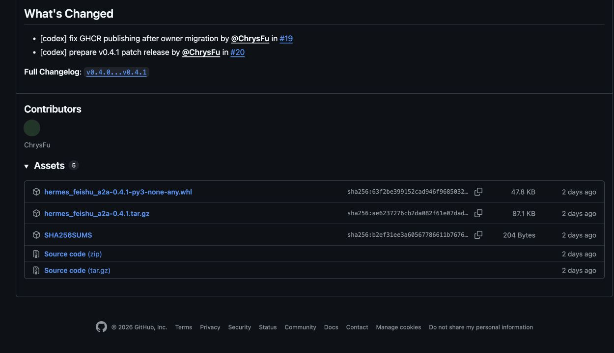](https://github.com/ChrysFu/hermes-feishu-a2a/releases/latest)

### 1. Verify the download

Compare the wheel hash printed by the command with the matching line in `SHA256SUMS`.

macOS:

```bash
cd ~/Downloads
shasum -a 256 hermes_feishu_a2a-0.4.1-py3-none-any.whl
cat SHA256SUMS
```

Linux:

```bash
cd ~/Downloads
sha256sum hermes_feishu_a2a-0.4.1-py3-none-any.whl
cat SHA256SUMS
```

Windows PowerShell:

```powershell
Set-Location "$HOME\Downloads"
(Get-FileHash .\hermes_feishu_a2a-0.4.1-py3-none-any.whl -Algorithm SHA256).Hash.ToLowerInvariant()
Get-Content .\SHA256SUMS
```

### 2. Install the wheel into an isolated directory

macOS or Linux:

```bash
mkdir -p ~/hermes-feishu-a2a
cd ~/hermes-feishu-a2a
python3 -m venv .venv
.venv/bin/python -m pip install --upgrade pip
.venv/bin/python -m pip install ~/Downloads/hermes_feishu_a2a-0.4.1-py3-none-any.whl
.venv/bin/hermes-a2a --help
```

Windows PowerShell:

```powershell
New-Item -ItemType Directory -Force "$HOME\hermes-feishu-a2a" | Out-Null
Set-Location "$HOME\hermes-feishu-a2a"
py -3.11 -m venv .venv
.venv\Scripts\python.exe -m pip install --upgrade pip
.venv\Scripts\python.exe -m pip install "$HOME\Downloads\hermes_feishu_a2a-0.4.1-py3-none-any.whl"
.venv\Scripts\hermes-a2a.exe --help
```

The virtual environment keeps Hermes and its dependencies separate from the computer's
system Python. The examples call the executable by its full path, so shell activation is
not required.

### 3. Generate and edit the first configuration

Run these commands from the `hermes-feishu-a2a` directory created above.

macOS or Linux:

```bash
.venv/bin/hermes-a2a init --directory .
.venv/bin/hermes-a2a validate-config --path config/agents.yaml --json
.venv/bin/hermes-a2a doctor --offline --config config/agents.yaml --data-dir data
```

Windows PowerShell:

```powershell
.venv\Scripts\hermes-a2a.exe init --directory .
.venv\Scripts\hermes-a2a.exe validate-config --path config\agents.yaml --json
.venv\Scripts\hermes-a2a.exe doctor --offline --config config\agents.yaml --data-dir data
```

`init` creates the following local files without overwriting existing files:

| Path | What to configure |
| --- | --- |
| `.env` | Runtime mode, API token, database, Agent endpoint policy and optional Feishu credentials |
| `config/agents.yaml` | HTTP or Feishu Agents, capabilities and permissions |
| `compose.yaml` | Docker deployment pinned to the installed Hermes release |
| `examples/capability-routing.yaml` | Starter workflow definition |

The generated token is suitable for an initial local run. Before production, set
`HERMES_ENV=production`, add a narrow `HERMES_AGENT_ENDPOINT_ALLOWED_HOSTS` value and
enable `HERMES_AGENT_ENDPOINT_REQUIRE_HTTPS=true` in `.env`. Add Feishu values only if
the Feishu integration is needed. See [Production quick start](#quick-start) for the
complete variable table and validation rules.

### 4. Test, start and connect

First run the isolated demonstration, which needs no credentials or external software:

```bash
.venv/bin/hermes-a2a demo
```

On Windows, use `.venv\Scripts\hermes-a2a.exe demo`. Then start the configured service:

```bash
.venv/bin/hermes-a2a serve
```

On Windows, use `.venv\Scripts\hermes-a2a.exe serve`. Keep that terminal open while
Hermes is running, then check `http://127.0.0.1:8080/healthz` and open
`http://127.0.0.1:8080/docs` to call the API from a browser or another application.
Protected APIs require the `X-Hermes-Token` header containing the value generated in
`.env`.

For a background service with automatic restart, install Docker Desktop or Docker Engine
and use the generated release-pinned Compose file:

```bash
docker compose pull
docker compose up -d
docker compose ps
docker compose logs -f hermes
```

`docker compose down` stops Hermes without deleting its data. Do not run
`docker compose down --volumes` unless all Agent, workflow and run records should be
deleted. For Feishu, expose only `/webhooks/feishu` through an HTTPS reverse proxy; keep
the Agent and workflow APIs on a private network. See [Production deployment](#production-deployment)
for service-manager, backup and reverse-proxy guidance.

## Supported platforms

| Platform | Native installation | Container installation | Continuous validation |
| --- | --- | --- | --- |
| macOS | Python 3.11 or newer | Docker Desktop | `macos-latest` |
| Windows | Python 3.11 or newer | Docker Desktop with Linux containers | `windows-latest` |
| Linux | Python 3.11 or newer | Docker Engine and Compose v2 | `ubuntu-latest` |

The Python wheel is platform-independent. The published container supports
`linux/amd64` and `linux/arm64`.

<a id="quick-start"></a>

## Production quick start

### 1. Install

Prerequisites: Git and Python 3.11 or newer.

macOS or Linux:

```bash
git clone https://github.com/ChrysFu/hermes-feishu-a2a.git
cd hermes-feishu-a2a
python3 -m venv .venv
.venv/bin/python -m pip install --upgrade pip
.venv/bin/python -m pip install .
```

Windows PowerShell:

```powershell
git clone https://github.com/ChrysFu/hermes-feishu-a2a.git
Set-Location hermes-feishu-a2a
py -3.11 -m venv .venv
.venv\Scripts\python.exe -m pip install --upgrade pip
.venv\Scripts\python.exe -m pip install .
```

These commands do not require shell activation, so they also work when PowerShell
script execution is restricted.

### 2. Configure

To create a new standalone project with a generated internal token, an empty declarative
registry, a capability-routing workflow and a release-pinned Compose file:

```bash
hermes-a2a init --directory my-hermes
cd my-hermes
hermes-a2a validate-config --path config/agents.yaml --json
hermes-a2a doctor --offline --config config/agents.yaml --data-dir data
```

`init` preserves every existing target file unless `--force` is supplied. It never asks
for or generates Feishu or model-provider credentials.

For this source checkout, copy the production examples:

macOS or Linux:

```bash
cp .env.example .env
cp config/agents.example.yaml config/agents.yaml
```

Windows PowerShell:

```powershell
Copy-Item .env.example .env
Copy-Item config\agents.example.yaml config\agents.yaml
```

Edit both files and replace every core placeholder. Remove or clear the optional Feishu block for
an HTTP-only deployment. If any Feishu value is configured, all Feishu rows below become required.

| Variable | Purpose |
| --- | --- |
| `HERMES_INTERNAL_API_TOKEN` | Random value of at least 32 characters for protected APIs |
| `HERMES_FEISHU_APP_ID` | Feishu/Lark custom app ID; required only when Feishu is configured |
| `HERMES_FEISHU_APP_SECRET` | Custom app secret; required only when Feishu is configured |
| `HERMES_FEISHU_ENCRYPT_KEY` | Event subscription encrypt key used for signatures; required only when Feishu is configured |
| `HERMES_FEISHU_VERIFICATION_TOKEN` | Event subscription verification token; required only when Feishu is configured |
| `HERMES_FEISHU_ALLOWED_CHAT_IDS` | Comma-separated `oc_...` chat IDs; required only when Feishu is configured |
| `HERMES_FEISHU_OWNER_OPEN_IDS` | Comma-separated `ou_...` human owner IDs; required only when Feishu is configured |
| `HERMES_FEISHU_FILE_INTAKE_AGENT_ID` | Optional registered Agent that processes authorized Feishu file messages |
| `HERMES_AGENTS_CONFIG_PATH` | Agent registry file, normally `config/agents.yaml` |
| `HERMES_AGENT_ENDPOINT_ALLOWED_HOSTS` | Comma-separated positive host globs for HTTP Agent dispatch; required in production |
| `HERMES_AGENT_ENDPOINT_REQUIRE_HTTPS` | Reject non-HTTPS Agent endpoints when enabled |

`HERMES_PORT` controls native Python startup. `HERMES_PUBLISHED_PORT` controls the
host port used by Docker Compose; the container always listens on port 8080.

Generate the internal API token locally:

```bash
python3 -c "import secrets; print(secrets.token_urlsafe(48))"
```

On Windows, use `py -3.11` instead of `python3`.

Each HTTP Agent needs an `endpoint`. Each Feishu Agent needs an `open_id` and
`metadata.chat_id`. Invalid Agent records stop validation and startup instead of
failing during the first dispatch.

Validate the complete configuration:

macOS or Linux:

```bash
.venv/bin/hermes-a2a validate-config --path config/agents.yaml --production --json
```

Windows PowerShell:

```powershell
.venv\Scripts\hermes-a2a.exe validate-config --path config\agents.yaml --production --json
```

Run read-only local and connected diagnostics:

```bash
HERMES_INTERNAL_API_TOKEN="$HERMES_INTERNAL_API_TOKEN" \
  .venv/bin/hermes-a2a doctor --config config/agents.yaml \
  --data-dir data --base-url http://127.0.0.1:8080
```

Use `doctor --offline` to skip every network probe. Doctor always emits named
`pass`/`warn`/`fail`/`skip` checks and never prints token values.

### 3. Run

macOS or Linux:

```bash
.venv/bin/hermes-a2a serve
```

Windows PowerShell:

```powershell
.venv\Scripts\hermes-a2a.exe serve
```

Open these URLs after startup:

- `http://127.0.0.1:8080/healthz` for process health.
- `http://127.0.0.1:8080/readyz` for production configuration readiness.
- `http://127.0.0.1:8080/docs` for the interactive API.

`/readyz` returns HTTP 503 in production until the internal token and Agent endpoint allowlist are
valid. When Feishu is configured, its required values and allowlists must also be real and complete.

<a id="en-zero-credential-demo"></a>

## Zero-credential demo

The first run needs no Feishu tenant, app credentials, model API, or real business data.
The demo starts a temporary Hermes environment and two loopback HTTP Agents, loads the
researcher declaratively, registers the reviewer at runtime, routes the first task by
capability, and proves the reviewer's update/delete audit lifecycle before removing all
temporary state.

macOS or Linux:

```bash
git clone https://github.com/ChrysFu/hermes-feishu-a2a.git
cd hermes-feishu-a2a
python3 -m venv .venv
.venv/bin/python -m pip install .
.venv/bin/hermes-a2a demo
```

Windows PowerShell:

```powershell
git clone https://github.com/ChrysFu/hermes-feishu-a2a.git
Set-Location hermes-feishu-a2a
py -3.11 -m venv .venv
.venv\Scripts\python.exe -m pip install .
.venv\Scripts\hermes-a2a.exe demo
```

Full container path:

```bash
docker compose -f docker-compose.demo.yml up --build --abort-on-container-exit --exit-code-from demo-runner
docker compose -f docker-compose.demo.yml down --volumes
```

Compose starts Hermes, two independent mock Agents, and a one-shot demo runner. Hermes binds only to the host loopback interface, and runtime traffic stays inside an isolated Compose network; the first image build still downloads Python dependencies. The fixed demo token is public and restricted to this isolated demonstration. Never use it in production.

## Architecture

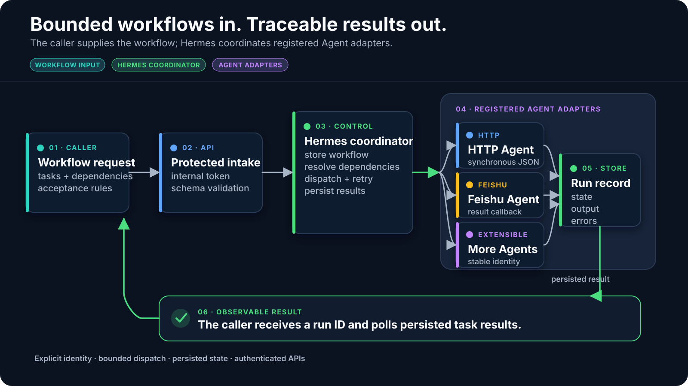

## Docker

Docker uses the same `.env` and `config/agents.yaml` files created above.

```bash
docker compose up --build -d
docker compose ps
docker compose logs -f hermes
```

The Compose file uses a named volume for SQLite data. This avoids host directory
ownership problems on Linux and works with Docker Desktop on macOS and Windows.

Stop the service without deleting data:

```bash
docker compose down
```

Delete the named data volume only when you intentionally want to erase all Agent,
workflow and run records:

```bash
docker compose down --volumes
```

## Agent contract

Agents can be owned by declarative `config/agents.yaml` desired state or by the
authenticated runtime control interface. Runtime records survive restarts; declarative
records are reconciled on startup, and runtime endpoints cannot mutate or delete them.
Every lifecycle change has a revision, timestamp and append-only audit event.

Register a runtime Agent, preview routing, and perform a concurrency-safe update:

```bash
curl -X POST http://127.0.0.1:8080/agents \
  -H "X-Hermes-Token: $HERMES_INTERNAL_API_TOKEN" \
  -H 'Content-Type: application/json' \
  -d '{"id":"writer","display_name":"Writer","role":"writing","capabilities":["writing"],"endpoint":"https://writer.internal/execute"}'

curl -X POST http://127.0.0.1:8080/agents/resolve \
  -H "X-Hermes-Token: $HERMES_INTERNAL_API_TOKEN" \
  -H 'Content-Type: application/json' \
  -d '{"required_capabilities":["writing"]}'
```

`PUT /agents/{id}` accepts the current revision in `If-Match`; a stale revision returns
`409`. `GET /agents/{id}/events` returns lifecycle actions without copying endpoint or
metadata values into the audit payload. HTTP endpoints reject URL credentials and
fragments, then apply the configured HTTPS and positive-host policy.

New Agents start `offline`. An adapter must send a heartbeat before Hermes routes or
dispatches work to it.

```json
{
  "status": "online",
  "capabilities": ["review", "testing"]
}
```

Send this payload to `POST /agents/{agent_id}/heartbeat` with the
`X-Hermes-Token` header.

### HTTP Agents

Hermes sends an HTTP `POST` request to the configured endpoint:

```json
{
  "run_id": "run-123",
  "task": {
    "id": "review",
    "title": "Review",
    "prompt": "Check the result",
    "agent_id": "reviewer"
  },
  "attachments": []
}
```

When a task contains Feishu attachment references, Hermes downloads and parses them
at dispatch time. The top-level `attachments` array then contains `name`, `media_type`,
`text`, and the original safe reference. File bytes and Feishu credentials are never
sent to the Agent.

The endpoint must return JSON containing `output` or `message`.

```json
{"output": "Review completed"}
```

### Feishu Agents

Hermes sends a native `at` post to the configured `open_id` and waits for the Agent
to reply in that task message thread or call `POST /events/agent-result`. Thread replies
are matched to the task message and registered Agent `open_id`. API callbacks must
include the same `run_id`, `task_id` and assigned `agent_id`.

For tasks with attachments, the native post includes the bounded extracted text after
the task prompt. Large content is truncated at `HERMES_FEISHU_FILE_MAX_AGENT_CHARS`.

```json
{
  "run_id": "run-123",
  "task_id": "review",
  "agent_id": "reviewer",
  "success": true,
  "output": "Review completed"
}
```

If neither a matching thread reply nor callback arrives before the task timeout, Hermes
applies the configured retry budget and eventually marks the task failed.

## Run a workflow

1. Confirm the target Agents are `online` with `GET /agents`.
2. Submit a JSON workflow definition to `POST /workflows`.
3. Start it with `POST /workflows/{workflow_id}/run`.
4. Poll `GET /runs/{run_id}` until the run is `succeeded` or `failed`.

All four endpoints require `X-Hermes-Token`. The interactive API at `/docs` is the
most portable way to perform the first run on macOS, Windows and Linux. Example
workflow definitions are available in [`examples/`](examples/).

A task may keep an explicit `agent_id` or use a deterministic selector:

```yaml
tasks:
  - id: research
    title: Gather evidence
    selector:
      required_capabilities: [research]
      required_permissions: [task:execute]
      transport: http
      metadata_equals:
        region: cn
    prompt: Gather primary-source evidence.
```

Selectors require exact capability, permission, transport and scalar metadata matches.
Offline and busy Agents are excluded; degraded Agents require explicit opt-in. Eligible
Agents are ordered by health, reported load, failure count and stable Agent ID. The full
candidate list and every inclusion/exclusion reason are persisted with the task result.

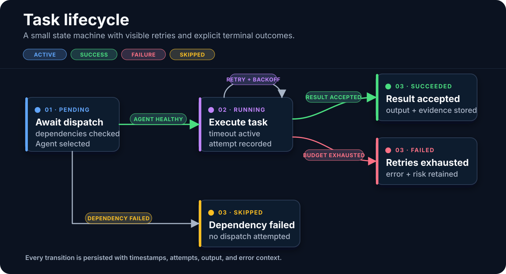

## Feishu configuration guide

The screenshots below use the current Feishu developer console. Click an image to open
it at full resolution. Account identifiers, the live callback domain and the publisher
name are redacted; the App Secret, Encrypt Key and Verification Token remain masked by
the Feishu console. Menu wording can vary slightly between Feishu and Lark tenants.

**1. Create an app and retrieve its credentials.** Create a Feishu/Lark custom app, then
open **Basic information → Credentials & Basic Info**. Copy the App ID and App Secret to
`HERMES_FEISHU_APP_ID` and `HERMES_FEISHU_APP_SECRET` in `.env`; never commit them to Git.

[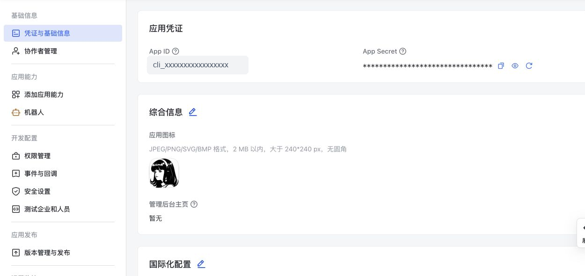](docs/assets/feishu-setup/01-app-credentials.png)

**2. Enable the bot capability.** Open **App capabilities → Bot**, enable the capability,
and set the bot name and description shown to users.

[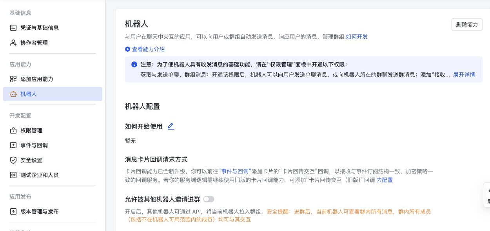](docs/assets/feishu-setup/02-bot-capability.png)

**3. Grant only the required API permissions.** Open **Development configuration →
Permissions** and add the tenant's message receive/send and chat-read permissions. Add
`im:resource` for files attached directly to messages. For shared `/file/...` cloud-space
links, add the application-identity scope `drive:file:download`; the broader
`drive:drive:readonly` also works but is not required.

[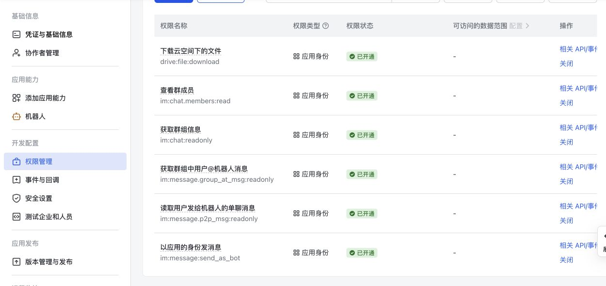](docs/assets/feishu-setup/03-permissions.png)

[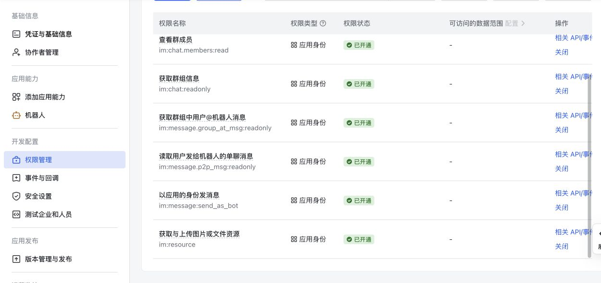](docs/assets/feishu-setup/03b-file-permission.png)

**4. Configure the callback and event subscription.** Open **Development configuration →
Events & Callbacks → Event configuration**, choose delivery to a developer server, enter
`https://your-host.example/webhooks/feishu`, and subscribe to `im.message.receive_v1`.
The callback must be publicly reachable over HTTPS; the screenshot uses the documentation
example domain.

[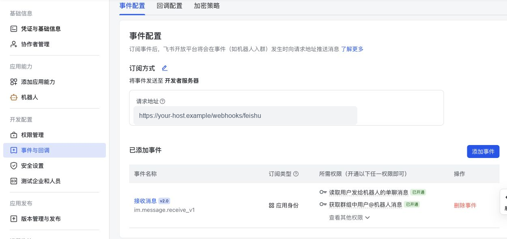](docs/assets/feishu-setup/04-event-subscription.png)

**5. Configure encryption and allow-lists.** On the same page, open **Encryption strategy**
and copy the Encrypt Key and Verification Token to `HERMES_FEISHU_ENCRYPT_KEY` and
`HERMES_FEISHU_VERIFICATION_TOKEN` in `.env`. Add the exact target chat IDs to
`HERMES_FEISHU_ALLOWED_CHAT_IDS` and trusted human owner open IDs to
`HERMES_FEISHU_OWNER_OPEN_IDS`. Do not reveal secret values with the eye icon while
recording or sharing screenshots.

[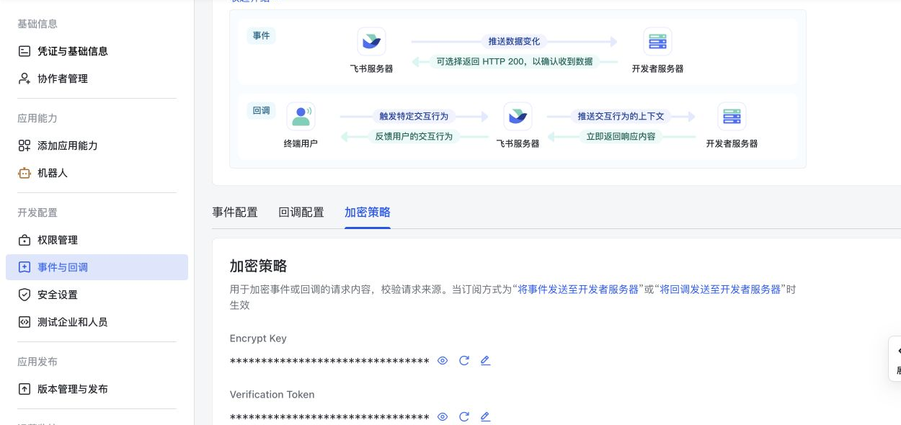](docs/assets/feishu-setup/05-encryption.png)

**6. Publish and add the bot to chats.** Open **App release → Version management & release**,
create a version, submit it for tenant approval, and confirm that its status becomes
published. Then add the bot to each chat included in the allow-list.

[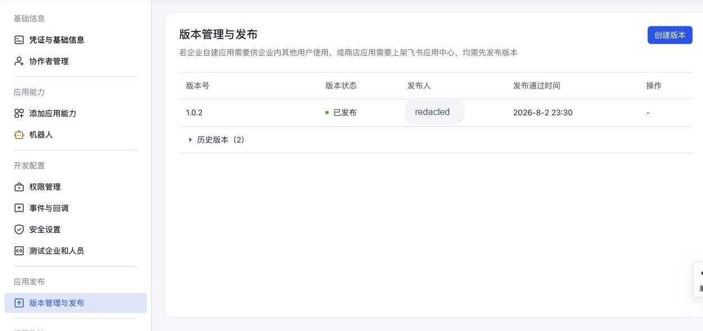](docs/assets/feishu-setup/06-release.png)

The webhook authenticates the raw request body before JSON parsing, then checks the
verification token, chat ID and sender identity. An accepted message is an integration
event; this service does not automatically translate natural language into a workflow.
Use an external planner or adapter to call the workflow API when that behavior is needed.

### File intake

Set `HERMES_FEISHU_FILE_INTAKE_AGENT_ID` to an HTTP or Feishu Agent from
`config/agents.yaml`, grant that Agent `attachment:read`, then make sure it sends an
`online` heartbeat. When an allow-listed human posts a supported attachment or a
`/file/...` link, Hermes:

1. extracts the message resource key or Drive file token;
2. downloads the file with the app's tenant token;
3. enforces the configured file-count, compressed/uncompressed byte, type and text limits;
4. extracts text from PDF, DOCX, TXT, Markdown, CSV or JSON;
5. starts one workflow on the intake Agent; and
6. replies to the original Feishu message with the Agent result.

Events are claimed by event/message ID so Feishu retries do not create duplicate runs.
Messages sent by registered Agents or other apps never trigger file intake, preventing
bot reply loops. Image-only or scanned PDFs require an external OCR adapter; Hermes
rejects PDFs that contain no extractable text.

See [Feishu permissions and event setup](docs/feishu-permissions.md) for the detailed
scope and callback checklist.

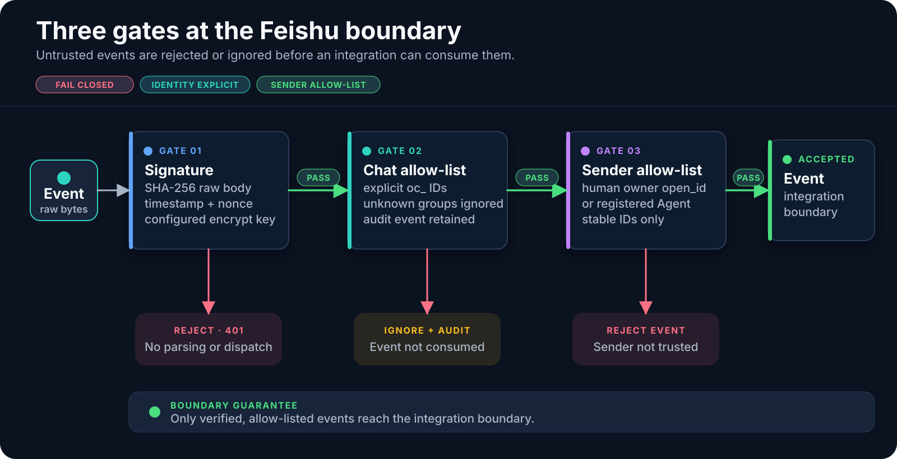

## API reference

Start Hermes and open `http://127.0.0.1:8080/docs` to explore and call these endpoints
through the generated Swagger interface. Protected endpoints require the
`X-Hermes-Token` header.

[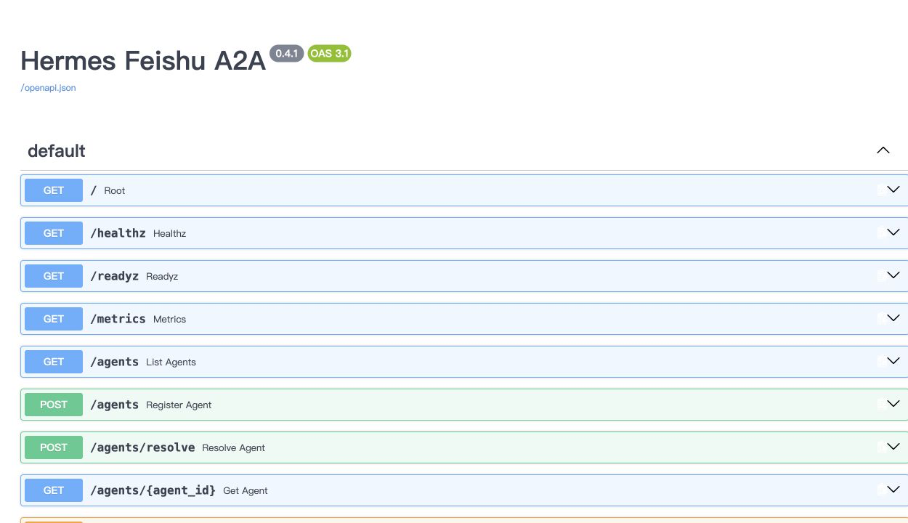](docs/assets/readme/api-docs.png)

| Endpoint | Authentication | Purpose |
| --- | --- | --- |
| `GET /healthz` | Network restriction | Process health |
| `GET /readyz` | Network restriction | Production configuration readiness |
| `GET /metrics` | Network restriction | Agent and workflow counters |
| `GET/POST /agents` | `X-Hermes-Token` | List or register runtime Agents |
| `GET/PUT/DELETE /agents/{id}` | `X-Hermes-Token` | Inspect, update or remove a runtime Agent |
| `GET /agents/{id}/events` | `X-Hermes-Token` | Inspect lifecycle audit events |
| `POST /agents/resolve` | `X-Hermes-Token` | Preview an explainable route decision |
| `POST /agents/{id}/heartbeat` | `X-Hermes-Token` | Update Agent health |
| `POST /workflows` | `X-Hermes-Token` | Store a workflow definition |
| `POST /workflows/{id}/run` | `X-Hermes-Token` | Start execution |
| `GET /runs/{run_id}` | `X-Hermes-Token` | Inspect task states and results |
| `POST /events/agent-result` | `X-Hermes-Token` | Complete an asynchronous Agent task |
| `POST /webhooks/feishu` | Feishu signature and token | Receive Feishu events |

## Production deployment

- Terminate TLS at a reverse proxy or managed load balancer.
- Expose only `/webhooks/feishu` publicly.
- Keep internal APIs on a private network in addition to using the internal token.
- Pin a release tag or container digest instead of deploying `main` directly.
- Back up the SQLite volume before upgrades.

Published release assets include a platform-independent wheel and source archive.
Published container tags support `linux/amd64` and `linux/arm64`:

```bash
docker pull ghcr.io/chrysfu/hermes-feishu-a2a:0.4.1
```

See [deployment](docs/deployment.md), [best practices](docs/best-practices.md), and
[troubleshooting](docs/troubleshooting.md) for operational details.

## Development

```bash
python -m pip install -e '.[dev]'
ruff check .
mypy src
pytest -q
python scripts/check_secrets.py
python -m build
```

See [CONTRIBUTING.md](CONTRIBUTING.md). This project is released under the
[MIT License](LICENSE).

---

<p align="right"><a href="#english">Back to English</a></p>

---

<a id="简体中文"></a>

# Hermes 飞书 A2A

<p align="center">
  
</p>

一个自托管的工作流协调器，通过 HTTP 或飞书/Lark 将边界明确的任务分派给已注册的 Agent。

[](https://github.com/ChrysFu/hermes-feishu-a2a/actions/workflows/ci.yml)
[](https://www.python.org/)
[](Dockerfile)
[](https://github.com/ChrysFu/hermes-feishu-a2a/releases)
[](LICENSE)

Hermes 存储声明式和运行时 Agent 注册信息，通过可检查的路由决策将任务约束匹配到在线能力，执行依赖屏障、超时和重试，并通过经过身份验证的 API 提供可追溯结果。飞书 webhook 事件会根据已配置的签名、会话白名单和发送者白名单进行验证。

Hermes 不包含 LLM 规划器或 Agent 运行时。调用方必须提交工作流定义，而每个 Agent 都必须提供 HTTP 适配器或飞书适配器，将结果返回 Hermes。飞书文件接收是一个确定性的例外：配置后，获得授权的文件消息会被路由到一个已注册的接收 Agent。

## 目录

- [从 GitHub Releases 安装](#zh-release-install)
- [支持的平台](#支持的平台)
- [生产配置快速开始](#zh-quick-start)
- [零凭据演示](#zh-zero-credential-demo)
- [架构](#架构)
- [Docker](#docker-1)
- [Agent 契约](#agent-契约)
- [运行工作流](#运行工作流)
- [飞书配置指南](#飞书配置指南)
- [API 参考](#api-参考)
- [生产部署](#生产部署)
- [开发](#开发)

<a id="zh-release-install"></a>

## 从 GitHub Releases 安装

对于希望直接运行 Hermes、但不想克隆源码仓库的用户，这是推荐的安装方式。wheel
会安装 `hermes-a2a` 命令，并可用于 Windows、macOS 和 Linux。它不是可双击运行的
桌面应用：请先安装 Python 3.11 或更高版本，再在终端中执行下面的命令。

打开[最新 GitHub Release](https://github.com/ChrysFu/hermes-feishu-a2a/releases/latest)
并下载下列文件。示例使用 `v0.4.1`；若已有更新版本，请在文件名和命令中统一使用
Release 页面显示的新版本号。

| Release 文件 | 用途 |
| --- | --- |
| `hermes_feishu_a2a-0.4.1-py3-none-any.whl` | 所有受支持操作系统通用的推荐安装包 |
| `SHA256SUMS` | 校验下载文件是否完整 |
| `hermes_feishu_a2a-0.4.1.tar.gz` | 用于审查或从源码构建；常规安装不需要 |

[](https://github.com/ChrysFu/hermes-feishu-a2a/releases/latest)

### 1. 校验下载文件

将命令输出的 wheel 哈希值与 `SHA256SUMS` 中对应文件的哈希值进行比较。

macOS：

```bash
cd ~/Downloads
shasum -a 256 hermes_feishu_a2a-0.4.1-py3-none-any.whl
cat SHA256SUMS
```

Linux：

```bash
cd ~/Downloads
sha256sum hermes_feishu_a2a-0.4.1-py3-none-any.whl
cat SHA256SUMS
```

Windows PowerShell：

```powershell
Set-Location "$HOME\Downloads"
(Get-FileHash .\hermes_feishu_a2a-0.4.1-py3-none-any.whl -Algorithm SHA256).Hash.ToLowerInvariant()
Get-Content .\SHA256SUMS
```

### 2. 把 wheel 安装到独立目录

macOS 或 Linux：

```bash
mkdir -p ~/hermes-feishu-a2a
cd ~/hermes-feishu-a2a
python3 -m venv .venv
.venv/bin/python -m pip install --upgrade pip
.venv/bin/python -m pip install ~/Downloads/hermes_feishu_a2a-0.4.1-py3-none-any.whl
.venv/bin/hermes-a2a --help
```

Windows PowerShell：

```powershell
New-Item -ItemType Directory -Force "$HOME\hermes-feishu-a2a" | Out-Null
Set-Location "$HOME\hermes-feishu-a2a"
py -3.11 -m venv .venv
.venv\Scripts\python.exe -m pip install --upgrade pip
.venv\Scripts\python.exe -m pip install "$HOME\Downloads\hermes_feishu_a2a-0.4.1-py3-none-any.whl"
.venv\Scripts\hermes-a2a.exe --help
```

虚拟环境会把 Hermes 及其依赖与电脑的系统 Python 隔离。示例直接使用可执行文件的
完整路径，因此无需激活 shell 环境，也适用于限制 PowerShell 脚本执行的电脑。

### 3. 生成并编辑首次配置

在上一步创建的 `hermes-feishu-a2a` 目录中执行以下命令。

macOS 或 Linux：

```bash
.venv/bin/hermes-a2a init --directory .
.venv/bin/hermes-a2a validate-config --path config/agents.yaml --json
.venv/bin/hermes-a2a doctor --offline --config config/agents.yaml --data-dir data
```

Windows PowerShell：

```powershell
.venv\Scripts\hermes-a2a.exe init --directory .
.venv\Scripts\hermes-a2a.exe validate-config --path config\agents.yaml --json
.venv\Scripts\hermes-a2a.exe doctor --offline --config config\agents.yaml --data-dir data
```

`init` 会生成以下本地文件，且默认不会覆盖已经存在的文件：

| 路径 | 需要配置的内容 |
| --- | --- |
| `.env` | 运行模式、API 令牌、数据库、Agent 端点策略和可选飞书凭据 |
| `config/agents.yaml` | HTTP 或飞书 Agent、能力和权限 |
| `compose.yaml` | 固定到当前 Hermes Release 的 Docker 部署文件 |
| `examples/capability-routing.yaml` | 入门工作流定义 |

自动生成的令牌可用于首次本地运行。生产部署前，应在 `.env` 中设置
`HERMES_ENV=production`，为 `HERMES_AGENT_ENDPOINT_ALLOWED_HOSTS` 填写范围尽可能小的
允许列表，并启用 `HERMES_AGENT_ENDPOINT_REQUIRE_HTTPS=true`。只有需要飞书集成时才添加
飞书配置。完整变量和验证规则见[生产配置快速开始](#zh-quick-start)。

### 4. 测试、启动并连接软件

先运行不需要凭据或外部软件的隔离演示：

```bash
.venv/bin/hermes-a2a demo
```

Windows 使用 `.venv\Scripts\hermes-a2a.exe demo`。确认演示通过后启动已配置的服务：

```bash
.venv/bin/hermes-a2a serve
```

Windows 使用 `.venv\Scripts\hermes-a2a.exe serve`。Hermes 运行期间应保持该终端打开，
然后访问 `http://127.0.0.1:8080/healthz` 检查状态，并打开
`http://127.0.0.1:8080/docs`，从浏览器或其他软件调用 API。受保护 API 需要携带
`X-Hermes-Token` 请求头，其值是 `.env` 中自动生成的内部令牌。

如需后台常驻和自动重启，请安装 Docker Desktop 或 Docker Engine，并使用自动生成、
固定到 Release 版本的 Compose 文件：

```bash
docker compose pull
docker compose up -d
docker compose ps
docker compose logs -f hermes
```

`docker compose down` 会停止 Hermes 但保留数据。除非确实要删除所有 Agent、工作流和
运行记录，否则不要执行 `docker compose down --volumes`。接入飞书时，只通过 HTTPS
反向代理公开 `/webhooks/feishu`，Agent 和工作流 API 应保留在私有网络中。服务管理、
备份和反向代理说明见[生产部署](#生产部署)。

## 支持的平台

| 平台 | 原生安装 | 容器安装 | 持续验证 |
| --- | --- | --- | --- |
| macOS | Python 3.11 或更高版本 | Docker Desktop | `macos-latest` |
| Windows | Python 3.11 或更高版本 | 使用 Linux 容器的 Docker Desktop | `windows-latest` |
| Linux | Python 3.11 或更高版本 | Docker Engine 与 Compose v2 | `ubuntu-latest` |

Python wheel 与平台无关。发布的容器支持 `linux/amd64` 和 `linux/arm64`。

<a id="zh-quick-start"></a>

## 生产配置快速开始

### 1. 安装

前置条件：Git 和 Python 3.11 或更高版本。

macOS 或 Linux：

```bash
git clone https://github.com/ChrysFu/hermes-feishu-a2a.git
cd hermes-feishu-a2a
python3 -m venv .venv
.venv/bin/python -m pip install --upgrade pip
.venv/bin/python -m pip install .
```

Windows PowerShell：

```powershell
git clone https://github.com/ChrysFu/hermes-feishu-a2a.git
Set-Location hermes-feishu-a2a
py -3.11 -m venv .venv
.venv\Scripts\python.exe -m pip install --upgrade pip
.venv\Scripts\python.exe -m pip install .
```

这些命令不要求激活 shell，因此在 PowerShell 脚本执行受限时也能使用。

### 2. 配置

如需创建独立项目，可一次生成内部令牌、空声明式注册表、能力路由示例和固定正式版本的 Compose 文件：

```bash
hermes-a2a init --directory my-hermes
cd my-hermes
hermes-a2a validate-config --path config/agents.yaml --json
hermes-a2a doctor --offline --config config/agents.yaml --data-dir data
```

除非传入 `--force`，`init` 会保留所有已存在的目标文件。该命令不会询问或生成飞书、模型提供商凭据。

在本源码目录中，可复制生产配置示例：

macOS 或 Linux：

```bash
cp .env.example .env
cp config/agents.example.yaml config/agents.yaml
```

Windows PowerShell：

```powershell
Copy-Item .env.example .env
Copy-Item config\agents.example.yaml config\agents.yaml
```

编辑两个文件并替换所有核心占位符。HTTP-only 部署应删除或清空可选的飞书配置块；一旦配置任一飞书值，下表中的飞书配置就全部成为必填项。

| 变量 | 用途 |
| --- | --- |
| `HERMES_INTERNAL_API_TOKEN` | 保护 API 的至少 32 字符随机值 |
| `HERMES_FEISHU_APP_ID` | 飞书/Lark 自建应用 ID；仅在配置飞书时必填 |
| `HERMES_FEISHU_APP_SECRET` | 自建应用密钥；仅在配置飞书时必填 |
| `HERMES_FEISHU_ENCRYPT_KEY` | 用于签名的事件订阅加密密钥；仅在配置飞书时必填 |
| `HERMES_FEISHU_VERIFICATION_TOKEN` | 事件订阅验证令牌；仅在配置飞书时必填 |
| `HERMES_FEISHU_ALLOWED_CHAT_IDS` | 以逗号分隔的 `oc_...` 会话 ID；仅在配置飞书时必填 |
| `HERMES_FEISHU_OWNER_OPEN_IDS` | 以逗号分隔的 `ou_...` 人类所有者 ID；仅在配置飞书时必填 |
| `HERMES_FEISHU_FILE_INTAKE_AGENT_ID` | 处理获授权飞书文件消息的可选 Agent |
| `HERMES_AGENTS_CONFIG_PATH` | Agent 注册表文件，通常为 `config/agents.yaml` |
| `HERMES_AGENT_ENDPOINT_ALLOWED_HOSTS` | HTTP Agent 分派允许的逗号分隔主机 glob；生产环境必填 |
| `HERMES_AGENT_ENDPOINT_REQUIRE_HTTPS` | 启用后拒绝非 HTTPS Agent 端点 |

`HERMES_PORT` 控制原生 Python 启动端口。`HERMES_PUBLISHED_PORT` 控制 Docker Compose 使用的主机端口；容器始终监听 8080 端口。

在本地生成内部 API 令牌：

```bash
python3 -c "import secrets; print(secrets.token_urlsafe(48))"
```

在 Windows 上使用 `py -3.11` 代替 `python3`。

每个 HTTP Agent 都需要 `endpoint`。每个飞书 Agent 都需要 `open_id` 和 `metadata.chat_id`。无效的 Agent 记录会使验证和启动停止，而不是在第一次分派时才失败。

验证完整配置：

macOS 或 Linux：

```bash
.venv/bin/hermes-a2a validate-config --path config/agents.yaml --production --json
```

Windows PowerShell：

```powershell
.venv\Scripts\hermes-a2a.exe validate-config --path config\agents.yaml --production --json
```

执行只读的本地与连接诊断：

```bash
HERMES_INTERNAL_API_TOKEN="$HERMES_INTERNAL_API_TOKEN" \
  .venv/bin/hermes-a2a doctor --config config/agents.yaml \
  --data-dir data --base-url http://127.0.0.1:8080
```

使用 `doctor --offline` 跳过全部网络探测。Doctor 始终输出具名的 `pass`/`warn`/`fail`/`skip` 检查，且不会打印令牌值。

### 3. 运行

macOS 或 Linux：

```bash
.venv/bin/hermes-a2a serve
```

Windows PowerShell：

```powershell
.venv\Scripts\hermes-a2a.exe serve
```

启动后打开以下 URL：

- `http://127.0.0.1:8080/healthz`：进程健康状态。
- `http://127.0.0.1:8080/readyz`：生产配置就绪状态。
- `http://127.0.0.1:8080/docs`：交互式 API。

在生产模式下，内部令牌和 Agent 端点允许列表有效后，`/readyz` 才不会返回 HTTP 503。若已配置飞书，其必需值与允许列表也必须真实且完整。

<a id="zh-zero-credential-demo"></a>

## 零凭据演示

首次体验不需要飞书租户、应用凭据、模型 API 或真实业务数据。演示会在本机启动临时 Hermes 环境和两个 loopback HTTP Agent，以声明方式加载 Researcher、通过运行时 API 注册 Reviewer、按能力路由第一项任务，并验证 Reviewer 的更新、删除和审计生命周期，最后清理全部临时状态。

macOS 或 Linux：

```bash
git clone https://github.com/ChrysFu/hermes-feishu-a2a.git
cd hermes-feishu-a2a
python3 -m venv .venv
.venv/bin/python -m pip install .
.venv/bin/hermes-a2a demo
```

Windows PowerShell：

```powershell
git clone https://github.com/ChrysFu/hermes-feishu-a2a.git
Set-Location hermes-feishu-a2a
py -3.11 -m venv .venv
.venv\Scripts\python.exe -m pip install .
.venv\Scripts\hermes-a2a.exe demo
```

完整容器链路：

```bash
docker compose -f docker-compose.demo.yml up --build --abort-on-container-exit --exit-code-from demo-runner
docker compose -f docker-compose.demo.yml down --volumes
```

Compose 会启动 Hermes、两个独立的 mock Agent 和一次性演示运行器。Hermes 仅绑定主机 loopback，运行阶段只访问隔离的 Compose 内部网络；首次构建镜像仍需要下载 Python 依赖。演示令牌是公开、固定且仅用于隔离演示的值，不能用于生产。

## 架构


## Docker

Docker 使用上面创建的相同 `.env` 和 `config/agents.yaml` 文件。

```bash
docker compose up --build -d
docker compose ps
docker compose logs -f hermes
```

Compose 文件使用命名卷存储 SQLite 数据。这可以避免 Linux 上的主机目录所有权问题，也适用于 macOS 和 Windows 上的 Docker Desktop。

停止服务但不删除数据：

```bash
docker compose down
```

只有在明确要删除所有 Agent、工作流和运行记录时，才删除命名数据卷：

```bash
docker compose down --volumes
```

## Agent 契约

Agent 可以由声明式 `config/agents.yaml` 期望状态管理，也可以由经过身份验证的运行时控制接口管理。运行时记录会跨重启保留；声明式记录在启动时协调，运行时端点不能修改或删除它们。每次生命周期变更都有 revision、时间戳和只追加审计事件。

注册运行时 Agent、预览路由并执行具备并发保护的更新：

```bash
curl -X POST http://127.0.0.1:8080/agents \
  -H "X-Hermes-Token: $HERMES_INTERNAL_API_TOKEN" \
  -H 'Content-Type: application/json' \
  -d '{"id":"writer","display_name":"Writer","role":"writing","capabilities":["writing"],"endpoint":"https://writer.internal/execute"}'

curl -X POST http://127.0.0.1:8080/agents/resolve \
  -H "X-Hermes-Token: $HERMES_INTERNAL_API_TOKEN" \
  -H 'Content-Type: application/json' \
  -d '{"required_capabilities":["writing"]}'
```

`PUT /agents/{id}` 可通过 `If-Match` 携带当前 revision；陈旧 revision 返回 `409`。`GET /agents/{id}/events` 返回生命周期操作，但不会把 endpoint 或 metadata 值复制进审计负载。HTTP endpoint 会拒绝 URL 凭据和 fragment，再应用已配置的 HTTPS 与正向主机策略。

新 Agent 初始为 `offline`。适配器必须先发送心跳，Hermes 才会路由或分派工作。

```json
{
  "status": "online",
  "capabilities": ["review", "testing"]
}
```

携带 `X-Hermes-Token` 请求头，将此负载发送到 `POST /agents/{agent_id}/heartbeat`。

### HTTP Agent

Hermes 向已配置的端点发送 HTTP `POST` 请求：

```json
{
  "run_id": "run-123",
  "task": {
    "id": "review",
    "title": "Review",
    "prompt": "Check the result",
    "agent_id": "reviewer"
  },
  "attachments": []
}
```

当任务包含飞书附件引用时，Hermes 会在分派时下载并解析附件。顶层 `attachments` 数组随后包含 `name`、`media_type`、`text` 和原始安全引用。文件字节和飞书凭据绝不会发送给 Agent。

端点必须返回包含 `output` 或 `message` 的 JSON。

```json
{"output": "Review completed"}
```

### 飞书 Agent

Hermes 向已配置的 `open_id` 发送原生 `at` 帖子，并等待 Agent 在该任务消息线程中回复，或调用 `POST /events/agent-result`。线程回复会与任务消息和已注册 Agent 的 `open_id` 匹配。API 回调必须包含相同的 `run_id`、`task_id` 和已分配的 `agent_id`。

对于带附件的任务，原生帖子会在任务提示后附上有边界的提取文本。较大内容会在 `HERMES_FEISHU_FILE_MAX_AGENT_CHARS` 处截断。

```json
{
  "run_id": "run-123",
  "task_id": "review",
  "agent_id": "reviewer",
  "success": true,
  "output": "Review completed"
}
```

如果在任务超时前既未收到匹配的线程回复，也未收到回调，Hermes 会使用已配置的重试预算，并最终将任务标记为失败。

## 运行工作流

1. 使用 `GET /agents` 确认目标 Agent 为 `online`。
2. 将 JSON 工作流定义提交到 `POST /workflows`。
3. 使用 `POST /workflows/{workflow_id}/run` 启动工作流。
4. 轮询 `GET /runs/{run_id}`，直到运行状态为 `succeeded` 或 `failed`。

四个端点都需要 `X-Hermes-Token`。`/docs` 的交互式 API 是在 macOS、Windows 和 Linux 上执行首次运行最便携的方式。[`examples/`](examples/) 中提供了工作流定义示例。

任务可以继续指定明确的 `agent_id`，也可以使用确定性 selector：

```yaml
tasks:
  - id: research
    title: Gather evidence
    selector:
      required_capabilities: [research]
      required_permissions: [task:execute]
      transport: http
      metadata_equals:
        region: cn
    prompt: Gather primary-source evidence.
```

Selector 要求能力、权限、传输和标量 metadata 精确匹配。离线和忙碌 Agent 会被排除；降级 Agent 需要显式允许。符合条件的 Agent 按健康状态、已报告负载、失败次数和稳定 Agent ID 排序。完整候选列表以及每项入选/排除原因都会随任务结果持久化。


## 飞书配置指南

以下截图来自当前飞书开发者后台，点击图片可查看原始尺寸。账户标识、实际回调域名和
发布者姓名已经脱敏；App Secret、Encrypt Key 和 Verification Token 保持飞书后台的
原生掩码状态。飞书与 Lark 租户的菜单文字可能略有不同。

**1. 创建应用并取得凭证。**创建飞书/Lark 自建应用，然后打开**基础信息 → 凭证与基础信息**。
将 App ID 和 App Secret 分别复制到 `.env` 的 `HERMES_FEISHU_APP_ID` 和
`HERMES_FEISHU_APP_SECRET`，不要提交到 Git。

[](docs/assets/feishu-setup/01-app-credentials.png)

**2. 启用机器人能力。**打开**应用能力 → 机器人**，启用机器人能力，并设置向用户展示的
机器人名称和描述。

[](docs/assets/feishu-setup/02-bot-capability.png)

**3. 仅授予所需 API 权限。**打开**开发配置 → 权限管理**，添加租户所需的消息接收/发送
和会话读取权限；对消息直接附加的文件添加 `im:resource`。若需读取共享的 `/file/...`
云空间链接，再添加应用身份权限 `drive:file:download`；更宽泛的
`drive:drive:readonly` 也可使用，但并非必需。

[](docs/assets/feishu-setup/03-permissions.png)

[](docs/assets/feishu-setup/03b-file-permission.png)

**4. 配置回调和事件订阅。**打开**开发配置 → 事件与回调 → 事件配置**，选择发送到开发者
服务器，填写 `https://your-host.example/webhooks/feishu`，并订阅
`im.message.receive_v1`。回调地址必须能通过公网 HTTPS 访问；截图中的域名已替换为文档示例。

[](docs/assets/feishu-setup/04-event-subscription.png)

**5. 配置加密参数和白名单。**在同一页面打开**加密策略**，将 Encrypt Key 和
Verification Token 分别复制到 `.env` 的 `HERMES_FEISHU_ENCRYPT_KEY` 和
`HERMES_FEISHU_VERIFICATION_TOKEN`。将准确的目标会话 ID 写入
`HERMES_FEISHU_ALLOWED_CHAT_IDS`，将可信人类所有者 open ID 写入
`HERMES_FEISHU_OWNER_OPEN_IDS`。录屏或分享截图时不要点击眼睛图标显示真实值。

[](docs/assets/feishu-setup/05-encryption.png)

**6. 发布应用并把机器人加入会话。**打开**应用发布 → 版本管理与发布**，创建版本并提交
租户审批；确认状态变为“已发布”后，再把机器人加入白名单中的每个目标会话。

[](docs/assets/feishu-setup/06-release.png)

Webhook 在解析 JSON 前对原始请求体进行身份验证，然后检查验证令牌、会话 ID 和发送者身份。已接受的消息是集成事件；本服务不会自动把自然语言转换成工作流。如需这种行为，请使用外部规划器或适配器调用工作流 API。

### 文件接收

将 `HERMES_FEISHU_FILE_INTAKE_AGENT_ID` 设置为 `config/agents.yaml` 中的 HTTP 或飞书 Agent，为其授予 `attachment:read`，并确保它发送 `online` 心跳。当白名单内的人类发布受支持的附件或 `/file/...` 链接时，Hermes 会：

1. 提取消息资源 key 或 Drive 文件 token；
2. 使用应用的 tenant token 下载文件；
3. 执行已配置的文件数量、压缩/解压字节数、类型和文本限制；
4. 从 PDF、DOCX、TXT、Markdown、CSV 或 JSON 中提取文本；
5. 在接收 Agent 上启动一个工作流；
6. 在原飞书消息中回复 Agent 结果。

事件会按事件/消息 ID 认领，因此飞书重试不会创建重复运行。已注册 Agent 或其他应用发送的消息绝不会触发文件接收，从而防止机器人回复循环。纯图片或扫描 PDF 需要外部 OCR 适配器；Hermes 会拒绝不含可提取文本的 PDF。

详细权限与回调清单见[飞书权限和事件配置](docs/feishu-permissions.md)。


## API 参考

启动 Hermes 后打开 `http://127.0.0.1:8080/docs`，即可通过自动生成的 Swagger 界面
查看并调用这些端点。受保护的端点需要 `X-Hermes-Token` 请求头。

[](docs/assets/readme/api-docs.png)

| 端点 | 身份验证 | 用途 |
| --- | --- | --- |
| `GET /healthz` | 网络限制 | 进程健康状态 |
| `GET /readyz` | 网络限制 | 生产配置就绪状态 |
| `GET /metrics` | 网络限制 | Agent 和工作流计数器 |
| `GET/POST /agents` | `X-Hermes-Token` | 列出或注册运行时 Agent |
| `GET/PUT/DELETE /agents/{id}` | `X-Hermes-Token` | 检查、更新或删除运行时 Agent |
| `GET /agents/{id}/events` | `X-Hermes-Token` | 检查生命周期审计事件 |
| `POST /agents/resolve` | `X-Hermes-Token` | 预览可解释路由决策 |
| `POST /agents/{id}/heartbeat` | `X-Hermes-Token` | 更新 Agent 健康状态 |
| `POST /workflows` | `X-Hermes-Token` | 存储工作流定义 |
| `POST /workflows/{id}/run` | `X-Hermes-Token` | 启动执行 |
| `GET /runs/{run_id}` | `X-Hermes-Token` | 检查任务状态和结果 |
| `POST /events/agent-result` | `X-Hermes-Token` | 完成异步 Agent 任务 |
| `POST /webhooks/feishu` | 飞书签名和令牌 | 接收飞书事件 |

## 生产部署

- 在反向代理或托管负载均衡器终止 TLS。
- 只公开 `/webhooks/feishu`。
- 除使用内部令牌外，还要将内部 API 保持在私有网络中。
- 固定发布标签或容器摘要，不要直接部署 `main`。
- 升级前备份 SQLite 数据卷。

发布资产包括与平台无关的 wheel 和源代码归档。发布的容器标签支持 `linux/amd64` 和 `linux/arm64`：

```bash
docker pull ghcr.io/chrysfu/hermes-feishu-a2a:0.4.1
```

运行细节见[部署](docs/deployment.md)、[最佳实践](docs/best-practices.md)和[故障排除](docs/troubleshooting.md)。

## 开发

```bash
python -m pip install -e '.[dev]'
ruff check .
mypy src
pytest -q
python scripts/check_secrets.py
python -m build
```

参见 [CONTRIBUTING.md](CONTRIBUTING.md)。本项目以 [MIT License](LICENSE) 发布。
